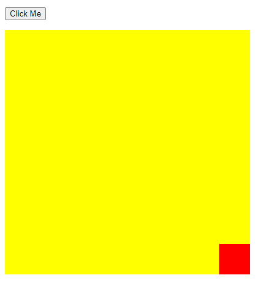

# PRAKTIKUM PEMROGRAMAN WEB 1
Pada praktikum pemrograman web I mempelajari HTML, CSS dan JavaScript.

## Identitas Diri
Nama : Yonan Prasetyo  
NIM : 230102023  
Kelas : TI-1A  

## HTML
1. HTML adalah singkatan dari Hyper Text Markup Language. 
2. HTML adalah bahasa markup standar untuk membuat halaman Web. 
3. HTML menjelaskan struktur halaman Web. HTML terdiri dari serangkaian elemen. 
4. Elemen HTML memberitahu browser bagaimana cara menampilkan konten. 
5. Elemen HTML memberi label pada potongan-potongan konten seperti 'ini adalah judul', 'ini adalah paragraf', 'ini adalah tautan', dll.

### Heading
Heading HTML adalah judul atau subjudul yang ingin Anda tampilkan di halaman web.  

### Paragraf
Elemen HTML 
 mendefinisikan sebuah paragraf.   
Sebuah paragraf selalu dimulai di baris baru, dan browser secara otomatis menambahkan sedikit spasi putih (margin) sebelum dan setelah sebuah paragraf.  

### Quotation
Dalam bab ini, kita akan membahas elemen HTML "blockquote", "q", "abbr", "address", "cite", dan "bdo".  
- Elemen HTML "blockquote" mendefinisikan bagian yang dikutip dari sumber lain.
- Tag HTML "q" mendefinisikan kutipan pendek.
- Tag HTML "abbr" mendefinisikan singkatan atau akronim, seperti "HTML","CSS", "Tn.", "Dr.", "Segera", "ATM".
- Tag HTML "address" mendefinisikan informasi kontak untuk penulis/pemilik dokumen atau artikel.
- Tag HTML "cite" mendefinisikan judul dari karya kreatif (misalnya buku, puisi, lagu, film, lukisan, patung, dll.).
- BDO adalah singkatan dari Bi-Directional Override. Tag HTML "bdo" digunakan untuk mengubah arah teks saat ini:  

### Tabel
Tabel HTML memungkinkan para pengembang web untuk mengatur data ke dalam baris dan kolom.  

### List
Daftar HTML memungkinkan pengembang web untuk mengelompokkan seperangkat item terkait dalam daftar.  

## CSS
1. CSS adalah singkatan dari Cascading Style Sheets 
2. CSS menjelaskan bagaimana elemen HTML akan ditampilkan di layar, kertas, atau dalam media lain 
3. CSS menghemat banyak pekerjaan. Ini dapat mengontrol tata letak banyak halaman web sekaligus 
4. Lembar gaya eksternal disimpan dalam file CSS

### Border
Properti border CSS memungkinkan Anda menentukan gaya, lebar, dan warna border elemen. 

### Margin
Margin digunakan untuk menciptakan ruang di sekitar elemen, di luar border yang ditentukan.  

### Padding
Padding digunakan untuk menciptakan ruang di sekitar konten elemen, di dalam border yang ditentukan.  

### Height & Width
Properti "height" dan "width" CSS digunakan untuk mengatur tinggi dan lebar suatu elemen.  

### Box Model
Semua elemen HTML dapat dianggap sebagai kotak.  
Dalam CSS, istilah "model kotak" digunakan saat berbicara tentang desain dan tata letak. Model kotak CSS pada dasarnya adalah sebuah kotak yang melingkupi setiap elemen HTML. Ini terdiri dari: contetnt, padding, border, dan margin.  

### Text
CSS memiliki banyak properti untuk memformat teks.  

### Font

### List
Properti daftar CSS memungkinkan Anda untuk:  
- Mengatur penanda item daftar yang berbeda untuk daftar terurut 
- Mengatur penanda item daftar yang berbeda untuk daftar tak terurut 
- Menetapkan gambar sebagai penanda item daftar 
- Menambahkan warna latar belakang ke daftar dan item daftar  

### Tabel

### Display
Properti "display" digunakan untuk menentukan bagaimana suatu elemen ditampilkan di halaman web.  
Setiap elemen HTML memiliki nilai default, tergantung pada jenis elemen tersebut.  
Nlai "display" default untuk sebagian besar elemen adalah block atau inline. Properti "display" digunakan untuk mengubah perilaku "display" default dari elemen HTML.  

### Overflow
Properti "overflow" CSS mengontrol apa yang terjadi pada konten yang terlalu besar untuk masuk ke dalam area.  

### Z-index
properti "z-indeks" menentukan urutan tumpukan suatu elemen  

### Dropdown
Membuat dropdown yang dapat dihover dengan CSS.  

## JavaScript

### DOM Form
Validasi formulir HTML dapat dilakukan dengan JavaScript.  

### DOM CSS
DOM HTML memungkinkan JavaScript mengubah gaya elemen HTML.  

### DOM Animation
Cara membuat animasi HTML menggunakan JavaScript.  

### DOM Events
HTML DOM memungkinkan JavaScript bereaksi terhadap peristiwa HTML.  

